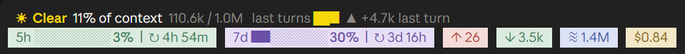

# usage-band

A collection of Claude Code plugins (mods) that add live status displays to the interface.

## usage-band

Displays session usage above the prompt: 5-hour and 7-day rate-limit consumption with reset countdowns, token counts, and session cost.



- **Context line**: context window utilization, with a trend chart of recent turns
- **5h / 7d**: rate-limit utilization and time remaining until reset
- **↑ / ↓**: input and output tokens for the current session
- **≈**: cached tokens
- **$**: accumulated cost for the current session

## pixel-helpers

When you send out helpers (subagents), a pixel office opens in the side pane. Each helper sits at a desk and randomly types, talks on the phone, rushes to the copier, drinks coffee, or thinks. Finished helpers raise their arms. Interrupted helpers turn grey and fall asleep at their desk.


- **Pane**: opens by itself when a helper starts, or with `/helpers`
- **Above the prompt**: while helpers work, a line shows how many are running and their names
- **Status**: running helpers show time worked and tools used; finished ones show the total time

## Install

```
claude plugin marketplace add mikekuo0725/usage-band
claude plugin install usage-band@usage-band
claude plugin install pixel-helpers@usage-band
```

---

# usage-band（中文）

本專案收錄 Claude Code 外掛（mod），為介面加入即時狀態顯示。

## usage-band

於輸入框上方即時顯示本次工作階段的用量資訊，包括 5 小時與 7 天額度使用率、重置倒數、token 用量及花費。


- **上下文列**：上下文視窗使用率，並以趨勢圖呈現最近幾輪的變化
- **5h / 7d**：額度使用率及距離重置的剩餘時間
- **↑ / ↓**：本次工作階段的輸入與輸出 token 數
- **≈**：快取 token 數
- **$**：本次工作階段的累計花費

## pixel-helpers

派小幫手時，右邊面板會顯示一間像素辦公室。每位小幫手坐在自己的辦公桌前，隨機打字、講電話、衝去影印、喝咖啡或想事情。做完的小幫手會舉起雙手；被打斷的會變灰、趴在桌上睡著。


- **面板**：小幫手出發時自動打開，或用 `/helpers` 打開
- **輸入框上方**：有小幫手在工作時，會顯示幾位在工作中和他們的名字
- **狀態**：工作中的顯示已工作時間和工具數；做完的顯示總共花多久；被中斷的顯示做了多久

## 安裝

```
claude plugin marketplace add mikekuo0725/usage-band
claude plugin install usage-band@usage-band
claude plugin install pixel-helpers@usage-band
```
